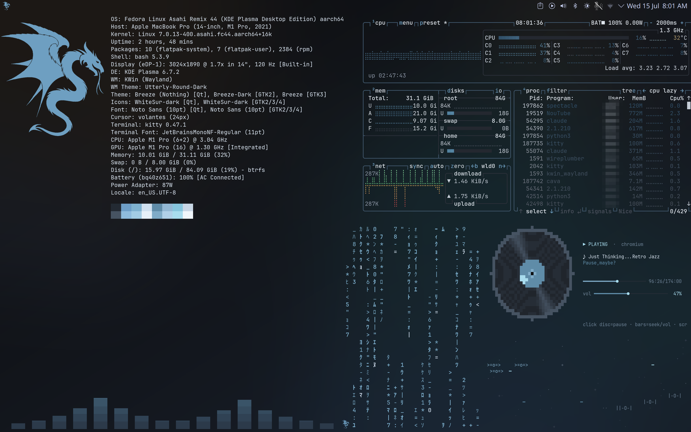
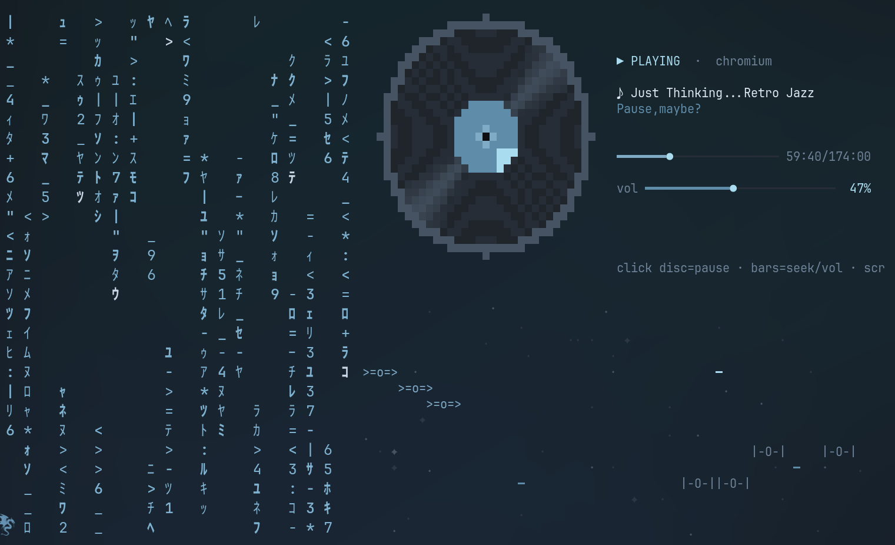
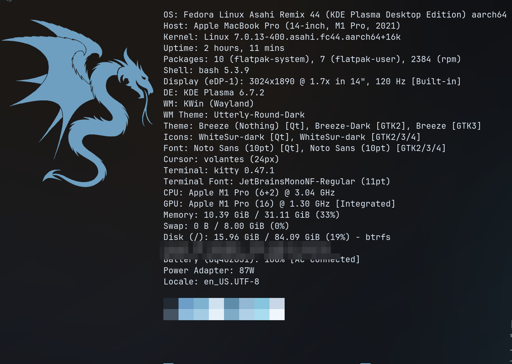
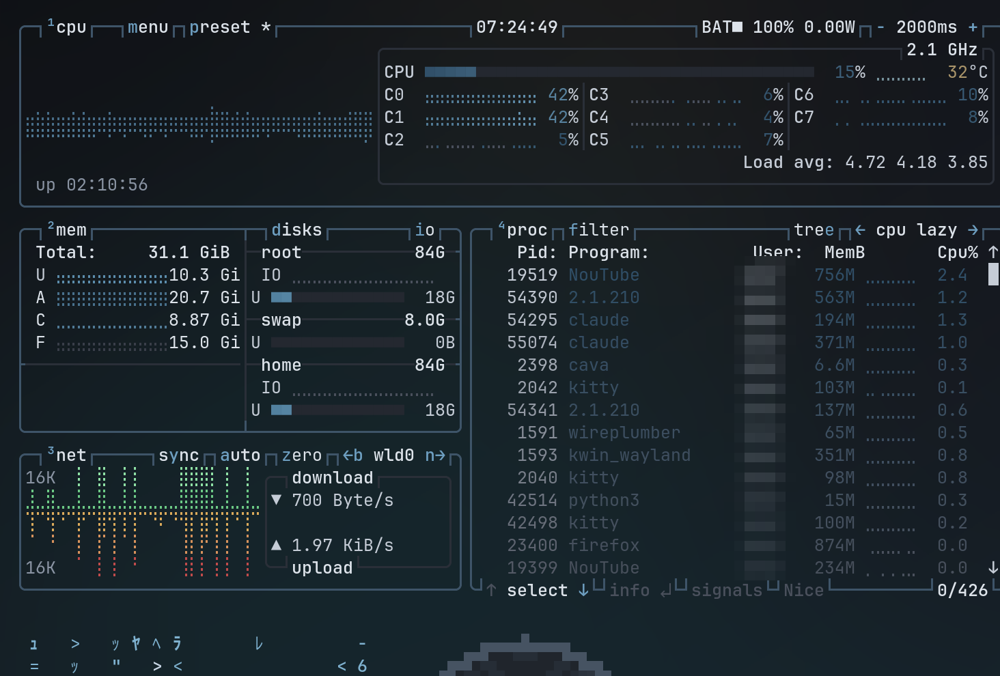
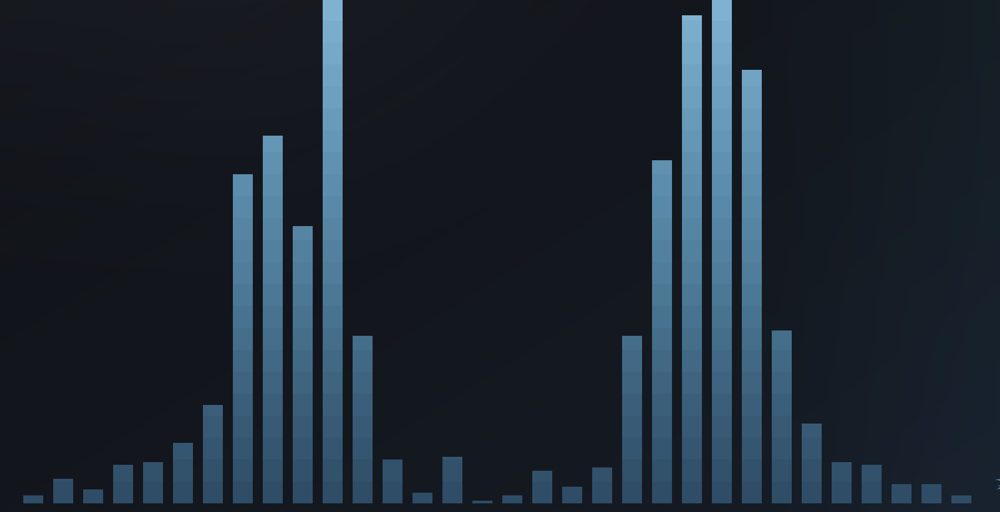

# 🐉 graphite-dragon-desktop

A graphite-steel terminal-panel desktop for **Fedora Asahi Linux (KDE Plasma / Wayland)** on Apple Silicon — six transparent kitty TUI panels floating on the wallpaper, a custom spinning-vinyl media controller, and an endless ASCII space battle.



## What you get

| Corner | Panel | What it is |
|---|---|---|
| top edge | **quickshell bar** ★ | ilyamiro's QuickShell top bar ported to KWin — workspace pills, MPRIS, tray, per-desktop palettes |
| top-left | **fastfetch** | System info beside a steel dragon, live-refreshing *without* flicker |
| top-right | **btop** | Full system monitor (interactive) |
| bottom-left | **cava** | Audio spectrum bars with a steel gradient |
| bottom-center-right | **unimatrix** | Matrix rain, katakana glyphs |
| right | **vinylctl** ★ | Custom MPRIS "now playing" deck — a vinyl record that actually spins |
| bottom-right | **vinylctl --eq** ★ | Dedicated 10-band system-wide equalizer panel |

★ = purpose-built for this setup, included in [`bin/`](bin/).

Everything is pinned into place by forced KWin window rules — panels never move, never take focus (except the interactive ones), never appear in the taskbar. A patched [krema](https://github.com/isac322/krema) dock with auto-hide and a custom KWin minimize animation (`kremadive`) round it out.

## Highlights

### 🧊 quickshell top bar — Hyprland rice, KWin blood
[ilyamiro's](https://github.com/ilyamiro/nixos-configuration) gorgeous QuickShell bar, ported off Hyprland: workspaces, MPRIS controls, tray, weather, network/battery — all driven by KWin D-Bus instead of hyprctl/sockets. Four named desktops (Main/Work/Fun/Lab) each recolor the whole bar live: ice, mint, violet, amber. Upstream ships no license, so `install.sh` clones it and applies our patch (`topbar/kwin-port.patch`) rather than vendoring the code.

### 🧬 four desktops, four dashboards
Main keeps the six-panel dashboard; Work, Fun and Lab are each filled to the same density on a two-column grid of forced-geometry widgets. **Work**: `workdeck` (pomodoro + todo) beside a full-height [calcurse](https://github.com/lfos/calcurse) agenda. **Fun**: a full-height cava visualizer, vinylctl, and a [cbonsai](https://github.com/jallbrit/cbonsai) growing underneath. **Lab** is wired for biology — `bionews` reads bioRxiv, Nature, Science, PLOS Biology, Cell, ScienceDaily and Quanta through a private [newsboat](https://github.com/newsboat/newsboat) profile, while `biopaper` rotates the newest bioRxiv preprint abstracts. Eight widget windows share a single kitty process (~118 MB) — see [§11](docs/TUTORIAL.md).

### 🎵 vinylctl — the media deck


A ~600-line zero-dependency Python TUI that controls **whatever is playing anywhere** (browser tabs included) via MPRIS/playerctl:
- half-block-pixel vinyl that spins while music plays, stops on pause
- full mouse support: click the disc to pause, click the progress bar to seek, click/scroll the volume bar
- keyboard: `space` pause · `n`/`b` skip · `←`/`→` seek · `↑`/`↓` system volume (PipeWire) · `m` mute · `tab` cycle players
- **built-in 10-band equalizer** (`e` or click `[⌁EQ]`, or run `vinylctl --eq` as a dedicated always-on panel): a system-wide PipeWire filter-chain sink ([`config/pipewire`](config/pipewire/pipewire.conf.d/vinylctl-eq.conf)) with Apple-Music-style presets (Loudness, Bass Booster, Vocal, …), a ±12 dB preamp for quiet speakers, drag-the-bars mouse control, live updates via `pw-cli`, settings persisted to `~/.config/vinylctl/eq.json` and kept in sync across instances

### ⚔️ starwars-scene — the forever war (retired, still included)
X-wings vs TIE fighters over a drifting parallax starfield: lasers, explosions, respawns. Runs forever at 12 fps in its own non-focusable panel. (Requires `disable_ligatures always` in the kitty config — ship ASCII gets eaten by font ligatures otherwise. Included.) Its bottom-right slot is now the equalizer panel; re-enable it by removing `Hidden=true` from [`autostart/panel-starwars.desktop`](autostart/panel-starwars.desktop).

### 🐲 fastfetch without the glitch


The usual `watch fastfetch` loop re-transmits the logo image every cycle and flashes. [`bin/panel-fastfetch.sh`](bin/panel-fastfetch.sh) draws the image **once**, then repaints only the text lines in place every 5 s — live stats, zero flicker, hidden cursor.

### 🪟 kremadive — minimize animation without icon geometry
Docks that don't publish taskbar icon geometry (krema, many standalone docks) silently break KDE's squash/magic-lamp effects — windows just blink out. [`kwin/effects/kwin4_effect_kremadive`](kwin/effects/kwin4_effect_kremadive) is a scripted KWin effect that dives windows to the bottom-center dock instead, no icon geometry needed.

### More shots

| | |
|---|---|
|  |  |

## Install

```bash
git clone https://github.com/wakeupbrk/graphite-dragon-desktop
cd graphite-dragon-desktop
./install.sh
```

Then follow the manual steps it prints (packages, dock, wallpaper). **Read [docs/TUTORIAL.md](docs/TUTORIAL.md)** for the full walkthrough — including how to adapt the KWin panel geometry to your own screen resolution (the included rules are for a 1789×1112-logical / 3024×1890-physical display at 1.7× scale).

### Requirements

- KDE Plasma 6 on Wayland (tested on Fedora Asahi Remix 44, MacBook Pro M1 Pro)
- `kitty`, `btop`, `cava`, `fastfetch`, `playerctl`, PipeWire (`wpctl`)
- [`unimatrix`](https://github.com/will8211/unimatrix), a Nerd Font (JetBrains Mono NF)
- optional: [krema](https://github.com/isac322/krema) dock, `mpd`+[`rmpc`](https://github.com/mierak/rmpc) for a local-library player (configs in [`config/rmpc/`](config/rmpc/))

## License

MIT — see [LICENSE](LICENSE). The dragon artwork and wallpaper are personal assets; replace them with your own spirit animal if you fork the vibe.
